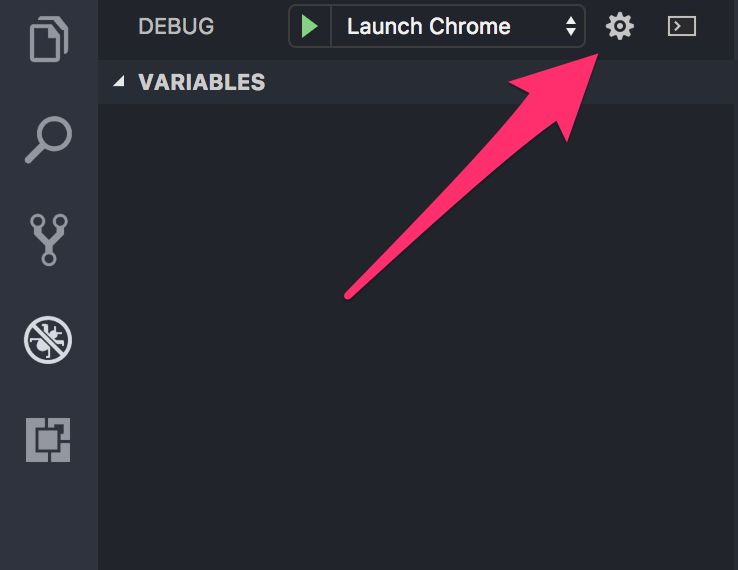
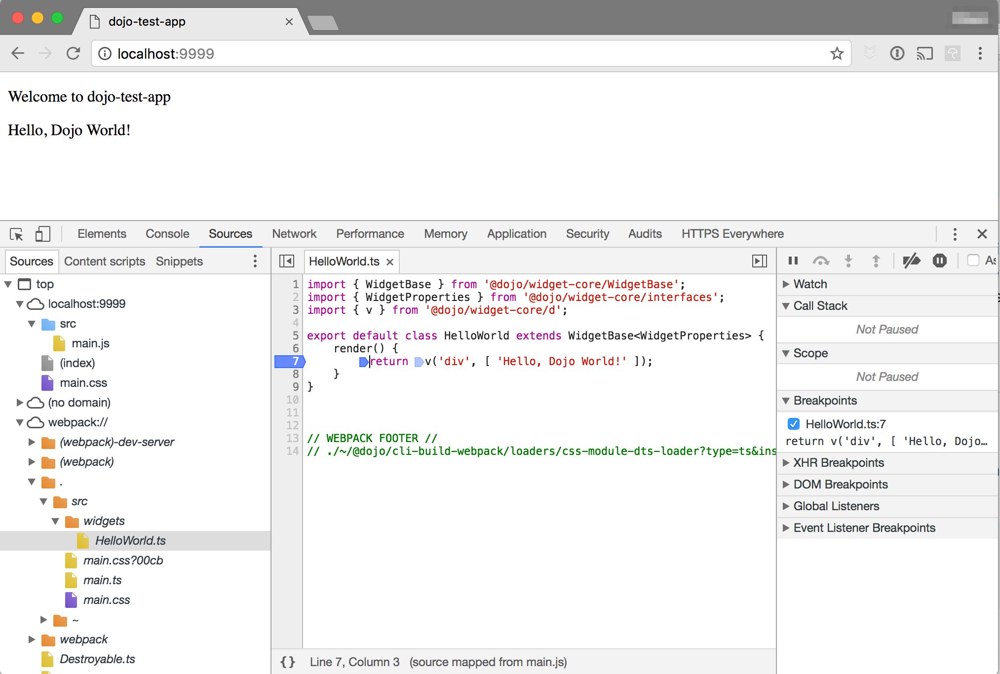

# Development environment

## Overview

The development experience was an important consideration as we built Dojo 2.  We have tried to follow the concept of
_smart defaults_ to make the common use cases work, but provide the flexiblity for developers to easily integrate
the creation and building of Dojo 2 applications into their environment.  This document discusses major parts of a
develop environment, links to references and further documentation, and any specifics about developing with Dojo 2.

## Command line tools

Dojo 2 is designed to make common development functions work _out of the box_.  The core of that is the `dojo` CLI which
can take several other installable commands.  Installation of the command line is covered in the
[Dojo 2 local installation](../000_local_installation) tutorial.

In order to leverage the `dojo` CLI, you will already have had to install `npm`, which comes as part of Node.js.  Having
supported versions of both of these tools available on the command line are important for an effective development
environment.

A development environment also needs some sort of version control system, to manage different versions of code.  All of Dojo
2 uses `git` as the version control tool and we manage all of our code on GitHub.  Several of READMEs and other instructions
will assume that `git` is being used for version control.  If you do not have `git` available on the command line, you can
follow [these instructions](https://git-scm.com/book/en/v2/Getting-Started-Installing-Git).  If you want `git` to be more
tightly integrated with GitHub on the command line, there is a tool called [`hub`](https://hub.github.com/) which can be used.

Almost all the editors below provided integration to `git` as well as there is the [GitHub Desktop](https://desktop.github.com/)
if you prefer a standalone graphical interface.

## Editors

You can edit Dojo 2 projects with any editor you feel comfortable with.  An editor
[that supports TypeScript](https://github.com/Microsoft/TypeScript/wiki/TypeScript-Editor-Support) will give you a richer
development experience, as Dojo 2 is built with TypeScript and specifically designed to take advantage of its features.

There are several editors which we have had good experience with and will cover aspects of how to best leverage them for your
development environment.

### Visual Studio Code

[Visual Studio Code](https://code.visualstudio.com/) (VSCode) not only integrates well with TypeScript, it is written in TypeScript.
It multi-platform and [open source](https://github.com/microsoft/vscode).

#### Tasks and Dojo cli

VSCode allows you to [configure tasks](https://code.visualstudio.com/docs/editor/tasks) which are then integrated into the IDE.
VSCode auto detects certain types of tasks, but for the `dojo` CLI, you will have to configure them manually to be accessible
in the IDE.

To configure tasks:

* Press <kbd>⌘⇧P</kbd>/<kbd>Ctrl⇧P</kbd> to bring up the command list.
* Start typing <kbd>tasks</kbd> and select the command `Tasks: Configure Task Runner`


The following is an example of configuring the tasks `build`, `test`, and `watch` to be available within the VSCode IDE:

```json
{
    "version": "0.1.0",
    "command": "dojo",
    "isShellCommand": true,
    "args": [],
    "showOutput": "always",
    "suppressTaskName": true,
    "tasks": [
        {
            "taskName": "build",
            "args": [ "build" ],
            "isBuildCommand": true,
            "problemMatcher": {
                "owner": "dojo",
                "fileLocation": "relative",
                "pattern": [
                    {
                        "regexp": "^(\\S+) in (.*)",
                        "severity": 1,
                        "file": 2
                    }, {
                        "regexp": "\\((\\d+),(\\d+)\\):(.*)",
                        "line": 1,
                        "column": 2,
                        "message": 3
                    }
                ]
            }
        }, {
            "taskName": "test",
            "args": [ "test" ],
            "problemMatcher": {
                "owner": "dojo",
                "fileLocation": "relative",
                "pattern": [
                    {
                        "regexp": "^(\\S+) in (.*)",
                        "severity": 1,
                        "file": 2
                    }, {
                        "regexp": "\\((\\d+),(\\d+)\\):(.*)",
                        "line": 1,
                        "column": 2,
                        "message": 3
                    }
                ]
            }
        }, {
            "taskName": "watch",
            "args": [ "build", "--watch" ],
            "isBackground": true,
            "problemMatcher": {
                "owner": "dojo",
                "fileLocation": "relative",
                "pattern": [
                    {
                        "regexp": "^\\S+ in (.*)",
                        "file": 2
                    }, {
                        "regexp": "\\((\\d+),(\\d+)\\):\\s+(error|warning|info)\\s+(TS\\d+)\\s*:\\s*(.*)$",
                        "line": 1,
                        "column": 2,
                        "severity": 3,
                        "code": 4,
                        "message": 5
                    }
                ],
                "watching": {
                    "activeOnStart": true,
                    "beginsPattern": "^webpack: Compiling\\.\\.\\.",
                    "endsPattern": "^webpack: Compiled successfully\\."
                }
            }
        }
    ]
}
```

Once configured, the build command (<kbd>⌘⇧B</kbd>/<kbd>Ctrl⇧B</kbd>) will be configured as well as you will have the other
tasks available in the IDE:


#### Launching

VSCode has the ability to be configured [to launch](https://code.visualstudio.com/docs/editor/debugging#_launch-configurations)
your application with integrated debugging.  Out of the box, VSCode includes the Node.js debugger, but it can easily integrate
to the Chrome debugger as well.  This is provided by the
[Chrome debugger extension](https://marketplace.visualstudio.com/items?itemName=msjsdiag.debugger-for-chrome).

With that installed, you can configure VSCode to use the `dojo build --watch` command to launch your application and integrate
the browsers console and debugger right into VSCode.  You need to open your `launch.json` by clicking on the _gear_ icon in the
_Debug_ panel of VSCode:



With the `launch.json` open, you can edit the file to configure launch items as you wish.  The following JSON would provide
a launch item named _Launch Chrome_ and assumes you have configured your tasks as per the previous section:

```json
{
    "version": "0.2.0",
    "configurations": [
        {
            "type": "chrome",
            "request": "launch",
            "name": "Launch Chrome",
            "url": "http://localhost:9999",
            "sourceMaps": true,
            "preLaunchTask": "watch",
            "webRoot": "${workspaceRoot}"
        }
    ]
}
```

Launching using an integrated debugger allows you to interact with the console via, set breakpoints and watches, and see the call
stack all from the VSCode IDE.

### vim

<!-- TBC: Nick N is a good one for this -->

### Atom

<!-- TBC -->

### WebStorm

<!-- TBC: Paul S is a good one for this -->

## Testing

All of the tests for Dojo 2 are written to utilize Intern.  We have integrated Intern into the Dojo 2 CLI with the command
`dojo test`.  When using `dojo create` to scaffold your application, the `dojo test` command will automatically be included
as a development dependency.  It exists as a seperate `npm` package namded `@dojo/cli-test-intern`.

### Unit testing and functional testing

When using `dojo create` to scaffold your application, a folder named `tests` will be created with two sub folders named
`tests/functional` and `tests/unit`.  These are designed to contain your _unit_ and _functional_ tests.  As mentioned above
`@dojo/cli-test-intern` is installed as a development dependency.  This pre-configures [The Intern](https://theintern.github.io/)
as the testing framework.  While other frameworks can be used, we believe Intern provides the best overall feature set for
a test harness.

While definitions of testing can vary, we define _Unit Tests_ as tests which test specific units of codes, typically all of
the exports of a module.  Normally you would want to mock upstream dependencies in order to focus on just testing code of
the unit.  With `dojo test`, unit tests will be run in every environment configured, including Node.js.  We try to aim for
100% code coverage with our unit tests.

We define _Functional Tests_ as tests that run in a browser environment and user input is driven by a web driver, which
also gives advanced access to browser to determine if the tests are passing or failing.  With `dojo test`, these will only
run in browsers, either locally or remotely.

### Local Node.js testing

When you run the `dojo test` command without any additional arguments, the _unit tests_ for your project will be run under
Node.js.  It will do a development build of your project, run the tests, output the results, and provide you with code
coverage information.

### Local browser testing

When you run the `dojo test -a` command without any additional arguments, the _unit tests_ and _functional tests_ will be
attempted to run locally in Chrome.  Intern should automatically detect your local Chrome installation and you should see
the Chrome browser open, your tests execute, and then see the output in the console.

### Remote browser testing

`dojo test` comes pre-configured to work with remote on demand browser testing, including SauceLabs, BrowserStack, and
TestingBot.  By supplying the `-c`/`--config` flag plus `browserstack`, `testingbot`, or `saucelabs` plus either passing
or having configured in your environment the appropriate crendentials, Intern will connect to these remote services and
execute your tests on different browser environments.

### Using a psuedo DOM

We feel it is important that even if an application is only designed to be run in a browser that you are able to do as much
testing as possible in Node.js, as it is often quicker and easier to identify issues in the code.  In order to facilitate
this, it is necessary to provide the DOM APIs when testing your application under Node.js.  We have integrated
[`jsdom`](https://github.com/tmpvar/jsdom) to accomplish this.  `@dojo/cli-test-intern` is configured to automatically load
`jsdom` and configure an empty HTML document.  Both `document` and `window` are available in the global namespace.  For those
libraries included with Dojo 2, we have ensured that they properly detect a browser when running under Node.js.

This means you can generally write your unit tests as if you are always running in the browser and get meaningful unit test
results when running under Node.js.

## Debugging

If you are developing a Dojo 2 application in TypeScript, your application code is transpiled from TypeScript to JavaScript.
If you are also using `dojo build`, then your code is also being bundled and minimized.  This could make it challenging to
debug an application, but we have tried to make Dojo 2 applications integrate well into modern debugging tools.

[Source maps](https://github.com/mozilla/source-map) are the way on the web we can describe code that has been transformed
in some fashion.  The `dojo build` maps the code throughout the process so that both the original TypeScript code and CSS
code is available when debugging.  This should allow you to set breakpoints and watches on the original code as well as
see the original code when there is a run-time error.  Here is an example of the _Hello World_ application running with the
development tools open in Chrome:



Depending on which editor you are using and how it is configured, you might be able to access the development tool features
from within your IDE.

### Watching

The CLI command `dojo build --watch` is designed to allow incremental development and receive feedback in the browser.  The
command will host your built project on http://localhost:9999/ and rebuild your application every time it detects a change.
This also includes refreshing the application in your browser.

The port can be changed using the `--port` flag.  Additional options and information can be viewed by running
`dojo build --help`.

## Building

The CLI command `dojo build` will build your application and output it to the `dist` directory.